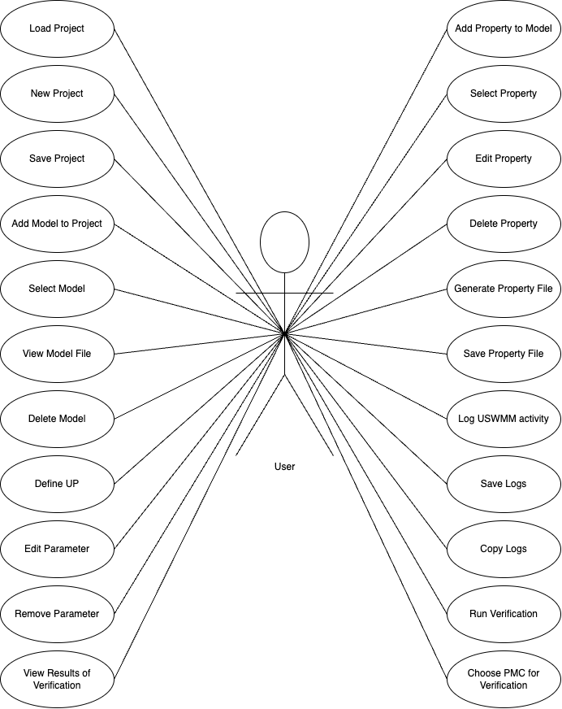
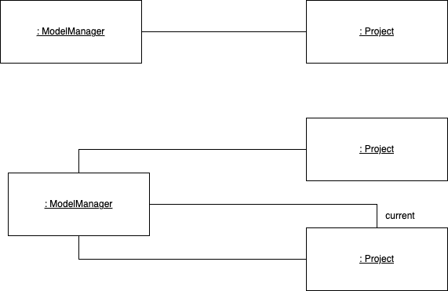
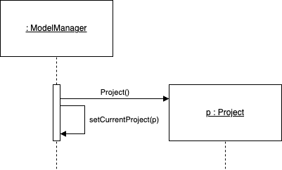
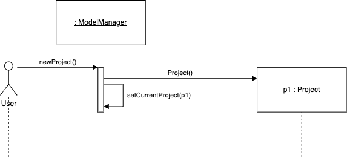
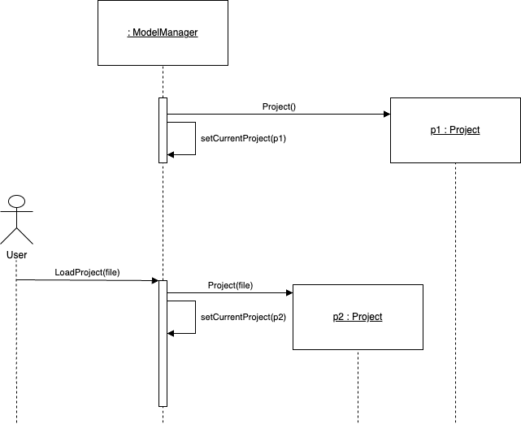

# ULTIMATE World Model Manager

## Tool Description (work in progress...)
 
The **ULTIMATE Stochastic World Model Manager (USWMM)** allows users to define *World Models* which are systems made up of many *models*. Additionally, users can solve *properties* for *models* in the *World Model* using PMCs (Probabalistic Model Checker) such as **PRISM** and **Storm**.

A *model* in this context is used to refer to a probabalistic model, typically defined using the [PRISM language](https://www.prismmodelchecker.org/manual/ThePRISMLanguage/Introduction). These *models* can be:

* discrete-time and continuous-time Markov chains (DTMCs and CTMCs)
* Markov decision processes (MDPs) and probabilistic automata (PAs)
* probabilistic timed automata (PTAs)
* partially observable MDPs and PTAs (POMDPs and POPTAs)
* interval Markov chains and MDPs (IDTMCs and IMDPs)

For each *model* in a *World Model*, the user may define a number of *parameters*. Typically, a PRISM model is created and contains a number of undefined constants. The tool recognizes these and allows the user to define them as a *parameter*. These fall into three categories:

1. Environment Parameters
2. Dependency Parameters
3. Internal Paramaters

*Environment Parameters* are calculated from a data file using a function specified by the user. 

*Dependency Paramaters* are calculated by solving a *property* on some other model in the *World Model*.

*Internal Parameters* ...

*Properties* are added to *models* and evaluated using a *PMC*. They are defined using the [PRISM Property Specification](https://www.prismmodelchecker.org/manual/PropertySpecification/Introduction).

*World Models* are made up of *models* as defined above. 

## Statement of Requirements

As the USWMM is both an interactive graphical tool and a command-line interface, the requirements are presented in two distinct sections. Firstly, there is a section detailing the 'functionality' of the tool. This can be thought of as *what* the tool can do. The user may access this functionality either through the GUI or the CLI. 

Secondly, there is a 'usability' section which aims to detail *how* the user interacts with the tool to make use of its functionality. This section is mostly concerned with how the GUI presents information and what kind of interaction the user has at their disposal. However, there is also a brief explanation of how the user uses the tool through the CLI.

### Functionality

The user should be able to do the following:

* Load an exisitng project
* Create a new blank project
* Save the current project
* Add a model to the current project
* Select a model from the current project
* View the selected models source file
* Delete a model from the project
* Define an **UP**, for example as an **EP**
* Edit an **EP**, **DP** or **IP**
* Remove an **EP**, **DP** or **IP**
* Add a property to a model
* Select a property for the current model
* Edit an existing property to the selected model
* Delete a property from the selected model
* Generate a property file for the selected model
* Save the generated property file
* Log the activity of the USWMM
* Copy the Logs
* Save the Logs to a file
* Run verification on a model and a property
* Choose a PMC with which to run verification
* View the results of verification

### Usability

When the USWMM is launched in GUI mode the workspace contains an empty project by default. The default view should show the user the following sections:

* A labelled list ( *model list* ) containing all the models in the project (initially empty).
* A button above the *model list* allowing the user to add a model.
* Three labelled lists, one for each parameter ( *param list* ) type.
* A labelled list for undefined constants ( *UC* ) extracted from the model file (contains all the constants found in the selected model's file).
* An *add* button for each *param list* to define an *UC*.
* An *edit* button for each *param list* to allow the user to edit a param.
* A *remove* button for each *param list* to remove a param (returning it to the list of *UC*).

The tool has a menu bar at the top with the typical *file* option. Clicking on this, the user would see the following options:

* Open
* New
* Save 
* Save As

If the user chooses to load an exisiting project, they will be presented with a file dialog asking them to choose a project file (eg some_project.ultimate). Alternatively, they may add a single model to the current project. There will be a button with clear labelling indicating to the user that pressing the button will add a model to the project workspace. When the button is pressed, they will choose a valid model file from the system through a file dialog. By default, the new model to be added to the project will be given the name of the module found in the model file (which may differ from the file name). The user may choose to edit the name of the model which will in turn edit the name of the module in the file so the two always match. The user will thenn confirm their choice and the model will be added to the workspace.  

In either case, when a project or models are added to the tool workspace, the user will be able to view the models in the current project as their names will be displayed in some list. The user can select any model from this list which will highlight the model and make it the current model.
When a model is chosen as the current model by selecting it, the user may add properties to or define parameters of the model in question. The user will have a choice of adding either a single property, which they will be prompted to define in a dialog, or they may choose a property file to add multiple properties to the currently selected model, which will open another file dialog. 

When a model is selected in the project space, any constants without assigned values that are found in the model file appear in the tool as a list of **"Uncategorised Parameters (UP)"**. For each **UP**, the user will be able to give it a concrete definition by adding it to one of the following categories:

* Environment Parameter (**EP**)
* Dependency Parameter (**DP**)
* Internal Parameter (**IP**)

For each category, there will be a list in the tool displaying the parameters that have been defined as such. Additonally, each of these lists will be labelled and contain a button to add a **UP** to the category. As each parameter type has different fields, the user is presented with unique dialog options to define the **UP** depending on whether they have chosen to define it as an **EP**, **DP** or **IP**. The fields used to define each category are as follows:

* **EP** -> name, data file (string path), type
* **DP** -> name, model ID, some property definition
* **IP** -> name

Each parameter will have the option to be edited or removed. If a parameter is removed, it simply reappears in the list of **UPs**. **UPs** cannot be removed from the model as they are derived from the model file. The file must be edited if the user wishes to remove some **UP**. Currently, the tool does not support editing of model files.

The user will have the option to run verification on the properties for the models in the project. In the case that a model is dependent on other models in the system, the user will be prompted to fully define each model (if not already done) before verification can take place. Otherwise, verification will proceed without this prompt. Additionally, the user may choose whether to run verification through Prism or Storm. In the case of the latter, the user will require an installation of Storm on their system and the tool will prompt the user to set the installation path before using Storm for verification. Prism, on the other hand, is integrated into the tool and requires no set-up so is used as the default PMC. During verification, a progress bar is displayed. When verification is complete, the user is shown a dialog confirming whether the verification was succesful or not. In either case, the view switches to a screen showing the logs of the verification attempt. These logs can be copied to the clipboard and/or saved to a file. This screen will also dsiplay a list of results which show the user:

* The name of the root model on which verification was run
* The results for the root model
* The path taken through the dependency graph during verification
* For each model visited, the result of verification on that model

The user will have the ability to save the current workspace as an ULTIMATE project. There will be both the typical **"Save"** and **"Save As"** options available. If the former is used before a file has been saved during the session, it will prompt the user to choose a name for the file and a save location, otherwise it will simply update the save file. The latter will always prompt the user with the option to choose a name and a save location. 

### Primary System Components

The following primary system objects have been derived from the requirements analysis:

* A Model Manager
* A Project
* A Model
* Uncategorized Parameter
* Environment Parameter
* Dependency Parameter
* Internal Parameter
* Logger
* Verification engine

## Use Cases

The following use cases are derived from the statement of requirements;

An UML representation of the identified use cases:

    
    
### New Project

Following the OOP design guideline that domain concepts should be modelled as objects, it is natural to model the *Model Manager (MM)* itself as an object. Each project will be modelled as a *Project* object. In this manner, the *MM* and *Project* objects have a relationship such that a *Project* will belong to an *MM*. That is, a *Project* is instantiated and managed by an *MM*. It is also possible for an *MM* object to manage many instances of *Project*. Below, both the scenario of a single project as well as multiple projects is modelled. In the case of the latter, an additional link called **current** is included to show which *Project* is currenly being managed by the *MM*.

	

As mentioned in the requirements, when the tool is first loaded, an empty *Project* is the default. Before diagramming a realisation of a *New Project*, it is worth putting together a sequence of what occurs when the tool first starts up. Below is the default sequence when launching the tool:

	

**Note:** Here there is no actor as the above is simply showing what the tool will do by default on launch

This start-up sequence can simply be extended into the *New Project* action:

	
	
**Possible Exceptional Cases:**

No clear exceptional cases are identified here. As the user does not pass any parameters to the *MM* when creating a *New Project*, it is unlikely for an exception to occure from this action. 

### Load Project

The following sequence diagram details what happens when the user chooses *Load Project* in the tool:

	

**Possible Exceptional Cases:**
	
In this instance, when the user calls *LoadProject(file)*, a string to some file is passed to the *MM* object. It is possible that the file does not exist or cannot be converted into a project object due to missing/incorrect data within the file. 

### Save Project

## Design View

