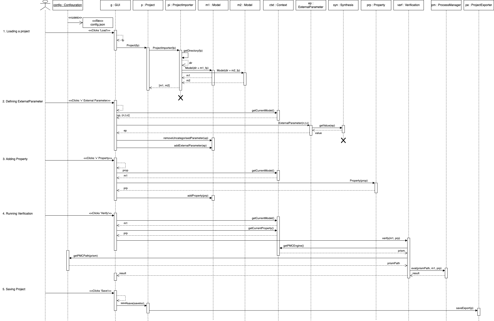
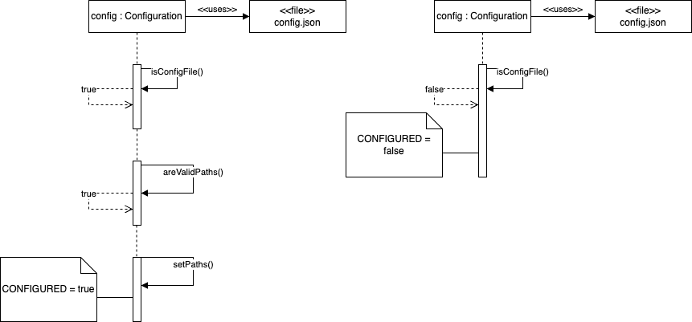
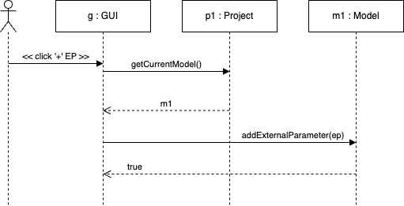
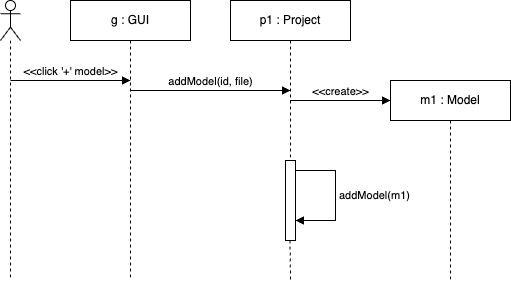

# ULTIMATE tool - Software Architecture, Design and Implementation

## Overview of the system

The *ULTIMATE* tool is made up of a number of *Primary System Components (PSCs)* that are discussed below. Throughout the remainder of this techinal paper, the term *component* will be used and may refer to either a Java object instance of a class more generally. For each such component, it's purpose, operation and actual implementation will be presented. This will follow the format of first outlining the role of the component in the wider system, it's responsibilites and tasks, what other components it interacts with and finally a brief discussion on the implementation of the component where there code will be considered. 

Before examing individual components, it is worth outlining the general structure of the system. This will not consider every component (such as specialised utlity classes) but rather focus on the *PSCs*.

First, these components will be listed and then presented in a diagram intended to give the reader an idea of how each component interacts. This diagram will model some sequence of events that corresponds to a particular use case of the system. The following are considered to be the *PSCs* of the system:

1. The [Configuration](#the-configuration-component) component
2. The [Dependency Parameter](#the-dependency-parameter-component) component
3. The [External Parameter](#the-external-parameter-component) component
2. The [Model](#the-model-component) component
2. The **Project** component
3. The **Synthesis** component
4. The **Property** component
6. The **Project Importer** component
7. The **Project Exporter** component
10. The **Verification** component
12. The **Context** component

Below is a simple UML sequence diagram that represents one possible use case of the system. Here, the user is loading a **Project** file, adding a **Model** to the project, defining an **External Parameter**, adding a **Property** and then carrying out a **Verification**. As previously mentioned, not every detail of the system will be covered here. Rather, this is intended to give the reader (and perhaps new maintainer) an intuition of how the system works.

**NOTE:** The GUI is represented as a single object to avoid too much complexity. In reality, the GUI is made up of a number of xml files (for layout) and controller classes (for control) that manipulate the Primary System Components. The GUI is discussed in it's own section later in the paper.

<p align="center">
	
	


## The Configuration Component

### Purpose

The purpose of this component is to ensure the software configuration file exists and that it contains valid data. Furthermore, this component allows other components access to information in the configuration file. If a correctly-formatted configuration file exists, a singleton is created that stores a number of strings. If either no configurationn file is found or it does not contain the correct data, the singleton is not created and the program is terminated. For this reason, the *'Configuration'* component is the first code that is run. If the singleton is succesfully created, then no errors are thrown and the program continues execution.

### Operation

First, the existence of *config.json* is confirmed before its contents are verified. To verifiy the contents of the file, the component expects 5 strings in the following format:

```json
{"stormInstall":"/Users/user/Desktop/storm","stormParsInstall":"/Users/user/Desktop/storm-pars","prismInstall":"/Users/user/Desktop/prism","prismGamesInstall":"/Users/user/Desktop/prismg","pythonInstall":"/opt/homebrew/bin/python3"}
```

If each of these binaries can be found and run then the component considers the contents valid. At this point the strings are assigned values. These can then be used where they are needed. In the case that the binaries cannot be found/run then the *Configuration* will set a flag (*Configuration.CONFIGURED*) that is used in *main()* to determine whether or not the program can continue. If the flag is *'false'* then the program will be aborted as these confiuration settings are essential for the operation of the tool.

The UML diagram below depicts two possible sequences for the *Configuration* component. On the left, we see that if *'config.json'* exists and the paths in the file point to binaries that can be run then the paths are set and the flag *'CONFIGURED'* is set to true. The right depicts an example where the file is not found and the flag is set to false. In the latter, the program will terminate as *'CONFIGURED'* must be true for execution to continue. 

<p align="center">
	

### Implementation

The code below is the implementation of the *'Configuration'* component. Below this is an example of how this component is used within *'main()'*. If the call to *Configuration.init()* fails (due to missing file, bad formatting etc), it will throw an error and main will halt. Otherwise, we will see the paths of the binaries printed and the tool will launch.

```java
public class Configuration {
	
	private static Configuration instance = null;
	public static String PRISM_PATH;
	public static String PRISM_GAMES_PATH;
	public static String STORM_PATH;
	public static String STORM_PARS_PATH;
	public static String PYTHON_PATH;
	public static boolean CONFIGURED = false;
	
	private Configuration() throws IOException, DataFormatException {
		if (isConfigFile() && areValidPaths()) {
            setPaths();
            CONFIGURED = true;
        }
	}
	
	public static void init() throws FileNotFoundException, IOException, DataFormatException {
		if (instance == null) {
			instance = new Configuration();
		}	
	}
	
	/*
	 * This method returns the 5 paths to the binaries
	 * 
	 * @return a map of the name of the binary and the path to it
	 * @throws DataFormatException if the file is not in the correct format
	 */
	private HashMap<String, String> getPaths() throws IOException, DataFormatException {
        File configFile = new File("config.json");
        String content = new String(Files.readAllBytes(Paths.get(configFile.toURI())));
        JSONObject configJSON = new JSONObject(content);
        HashMap<String, String> binaries = new HashMap<String, String>();
        try {
        	binaries.put("PRISM_PATH", configJSON.getString("prismInstall"));
        	binaries.put("PRISM_GAMES_PATH", configJSON.getString("prismGamesInstall"));
        	binaries.put("STORM_PATH", configJSON.getString("stormInstall"));
        	binaries.put("STORM_PARS_PATH", configJSON.getString("stormParsInstall"));
        	binaries.put("PYTHON_PATH", configJSON.getString("pythonInstall"));
		} catch (Exception e) {
			throw new DataFormatException("Configuration file is not in the correct format");
		}
        return binaries;
	}
	
	/*
	 * This method verifies that config.json exists where it is expected to be
	 * 
	 * @return true if config.json exists, false otherwise
	 * @throws FileNotFoundException if config.json does not exist
	 */
	private boolean isConfigFile() throws FileNotFoundException {
		boolean exists;
		exists = Files.exists(Paths.get("config.json"));
		if (exists) {
			return true;
		} else {
			throw new FileNotFoundException("Configuration file not found! This file is expected in directory where the code is being run");
		}
	}
	
	/*
	 * This method verifies that the paths in config.json are valid binaries on the system
	 * 
	 * @return true if the paths are valid, false otherwise
	 * @throws FileNotFoundException if the paths are not valid binaries
	 */
	private boolean areValidPaths() throws IOException, DataFormatException {
		// get the paths from the config.json file
		HashMap<String, String> binaries = getPaths();
		// check if the paths are valid
		for (String key : binaries.keySet()) {
			if (!Files.isExecutable(Paths.get(binaries.get(key)))) {
				throw new DataFormatException("Path to " + key + " is not valid");
			}
		}
		return true;
	}
	
	private void setPaths() {
		HashMap<String, String> binaries = null;
        try {
            binaries = getPaths();
        } catch (IOException | DataFormatException e) {
            e.printStackTrace();
        }
        PRISM_PATH = binaries.get("PRISM_PATH");
        PRISM_GAMES_PATH = binaries.get("PRISM_GAMES_PATH");
        STORM_PATH = binaries.get("STORM_PATH");
        STORM_PARS_PATH = binaries.get("STORM_PARS_PATH");
        PYTHON_PATH = binaries.get("PYTHON_PATH");
    }

}
```

Using the component in main:

```java
    public static void main(String[] args) throws FileNotFoundException, IOException, DataFormatException {
    	Configuration.init(); // Initialize the configuration settings
    	System.out.println("Configuration initialized");
    	System.out.println("PRISM_PATH: " + Configuration.PRISM_PATH);
    	System.out.println("PRISM_GAMES_PATH: " + Configuration.PRISM_GAMES_PATH);
    	System.out.println("STORM_PATH: " + Configuration.STORM_PATH);
    	System.out.println("STORM_PARS_PATH: " + Configuration.STORM_PARS_PATH);
    	System.out.println("PYTHON_PATH: " + Configuration.PYTHON_PATH);
        launch(args); // Launch the JavaFX application
    }
```

## The Dependency Parameter Component

### Purpose

The *Dependency Parameter* component serves as an extension to standard probabilistic models. One of the features of an *ULTIMATE Model* is that it may have a number of *Dependency Parameters*. When an *ULTIMATE Model*, let's call it *Model A*, has a dependency on *Model B*, it means that the tool must first carry out verification on *Model B* before solving for *Model A*. In this way, *ULTIMATE* projects can define complex relationships between models using the *Dependency Parameter* component.

### Operation

*Dependency Parameters* are always created and added to a *Model* (dicussed below). When using the tool in GUI-mode, the user can add a *Dependency Parameter* to a *Model* if it contains one or more *Uncategorised Parameters*. Below is a simplified sequence diagram. When the user clicks the '+' button next to 'Dependency Parameter' in the tool, a dialog will pop up asking the user which *Uncategorised Parameter* they would like to define. The user enters the details in the dialog box and they are verified. Then, the current *Project* is sent a message for a reference to the current *Model* (the one being edited in the tool) and the *Dependency Parameter* is added to the *Model* if possible. 

<p align="center">
	
	
## Implementation

The implementation of the *Dependency Parameter* is very simple. There is a number of basic getters and setters to mutate an instance. 

```java
public class DependencyParameter {
    private String name;
    private Model model;
    private String definition; // definition of the property to be verified on model
    private String result;
    
    public DependencyParameter(String name, Model model, String definition) {
        this.name = name;
        this.model = model;
        this.definition = definition;
    }
    
    // GETTER METHODS

    public String getName() {
    	return this.name;	
    }
    
    public Model getModel() {
    	return this.model;
    }
    
    public String getDefinition() {
    	return this.definition;
    }
    
	public String getResult() {
		return this.result;
	}
    
    // SETTER METHODS
    
    public void setName(String newName) {
    	this.name = newName;
    }
    
    public void setModel(Model newModel) {
    	this.model = newModel;
    }
    
    public void setDefinition(String newDefinition) {
    	this.definition = newDefinition;
    }
    
	public void setResult(String newResult) {
		this.result = newResult;
	}
    
    public String toString() {
    	return "Dependency Parameter: " + name + "\nModel ID: " + model.getModelId() + "\nProperty Definition: " + definition.replace("\\", "") + "\n";
    }
    
}
```

## The External Parameter Component

### Purpose

Much like the *Dependency Parameter* component, the *External Parameter* component is an extension to standard probabilistic models and part of the *ULTIMATE* framework. An *External Parameter* can be defined and added to a *Model* if it contains one or more *Uncategorised Parameters*. *External Parameters* are given a name, a type and (depending on type) either a hardcoded value or a data file from which a value is calculated.

### Operation

As mentioned, an *External Parameter* is always added to a *Model* instance. This follows the same logic as adding a *Dependency Parameter*. First the user enters the details into a dialog in the gui. The *Project* instance is asked for a reference to the current *Model* and then an *External Parameter* is added to the *Model*.

<p align="center">
	
	
However, the creation of an *External Parameter* is quite involved as it requires checking a data file exists, contains valid data and then extracting the data and calculating a value. This entire process will be carried out when constructing an *External Parameter*. Below is a simplified sequence depicting this series events:
	
### Implementation


``` java

```

## The Model component

### Purpose

The *'Model'* component is the central component in the system. Each *'Model'* component corresponds to a probabalistic model (eg PRISM model) and also contains the extra information specific to *ULTIMATE* models - *'External Parameters'*, *'Dependency Parameters'* and *'Uncategorised Parameters'*. All the information needed to carry out verification is contained within the *Models* and an *ULTIMATE* project is simply defined as some number of these *Model* components. 

### Operation

*Model* objects are defined by one parameter - the path to a probabilitic model file (eg xxx.prism or xxx.dtmc). These objects also contain several lists storing the following:

1. *External Parameters*
2. *Dependency Parameters*
3. *Uncategorsied Parameters*
4. *Properties*

These lists are updated/changed when the user operates the tool in GUI mode. The user can save changes made to a *Model* by saving the session as an *ULTIMATE* project.

The most important use for the *Model* objects is that of verification. Verification happens when the user asks the tool to calculate the value of some *Property* on some *Model*. When a *Property/Model* pair needs to be verified, the tool gets the location of the appropriate binary (eg PRISM) being used for verification and then calls this binary by passing the *Property* (stored in the model) and the path to the model file (that was passed during construction of the object). Importantly, the *Model* component creates a temporary file which is a copy of the file described by the file path used in initialisation. This copied file is passed to the verification binary and is deleted when the JVM terminates. This will be looked at in the implementation section further.

During operation of the tool, the user can add a *Model* by clicking the '+' button in the appropriate section. When this happens, the tool will add the *Model* to the current *Project*. If it is a blank *Project*, the user will be asked to create a new *Project*. Otherwise, the *Model* will simply be added to a list stored in the *Project* component.

<p align="center">
	
	
The above depicts the sequence in which a project already exists. In this instance, when the user presses the '+' button in the tool, a message is sent to the *Project* component to create a new *Model* object. Once the object is created, it is added to an array stored within the *Project* object (discussed below). 

### Implementation

The implementation of the *Model* is quite involved - although each indivindual method is simple in its own right. One key part to point out is the line: 

```java 
this.modelId = FileUtils.removePrismFileExtension(filePath);
```
This line uses a utility class to set the *modelId*. This utility will throw an error if the file at the location *filePath* (passed to constructor) is not a valid prism model file. Perhaps another method that is worth explaining is the method:

``` java
'public void addUncategorisedParametersFromFile()'
```

When a *Model* is created by importing a *Project*, first any defined parameters are added to model and then a call to the above is made. This method will parse the prism file and if it finds any constants without values and that have not been defined in the project file, it will add them to the *Model* as *Uncategorised Parameters*. Alternatively, if a *Model* is added to a project then all constants without values in the file will be added as *Uncategorised Parameters*. Therefore, this code is used in other parts of the system when a *Model* is created. All other methods are self-explanatory.

```java
/**
 * Represents a model in the system.
 * This class stores information about a model, including its unique ID, file path,
 * and various types of parameters associated with the model (e.g., dependency parameters, environment parameters).
 */
public class Model {
    private String modelId; // Unique identifier for the model
    private String filePath; // Path to the model's file
    //private String propertiesFile; // file of properties list
    private ObservableList<DependencyParameter> dependencyParameters; // List of dependency parameters
    private ObservableList<ExternalParameter> externalParameters; // List of environment parameters
    private ObservableList<UncategorisedParameter> uncategorisedParameters; // List of undefined parameters
    private ObservableList<Property> properties;
    private File verificationFile;
    
    /**
     * Constructor to initialise a new Model object.
     *
     * @param filePath the file path of the model
     * @throws IOException if the file is not a valid PRISM model
     */
    public Model(String filePath) throws IOException {
        this.modelId = FileUtils.removePrismFileExtension(filePath); // will throw an error if the file is not prism file
        this.filePath = filePath;
        this.dependencyParameters = FXCollections.observableArrayList();
        this.externalParameters = FXCollections.observableArrayList();
        this.uncategorisedParameters = FXCollections.observableArrayList();
        this.properties = FXCollections.observableArrayList();
        this.verificationFile = tempModelFile();
    }
    
    /*
     * Adds a property to the model
     * 
     * @param newProp the property to add
     * @return true if the property was added, false otherwise
     */
    public boolean addProperty(String newProp) {
    	for (Property p : properties) {
    		if (p.getProperty().equals(newProp)) {	// check the property is novel
    			return false;
    		}
    	}
		properties.add(new Property(newProp));
		return true;
    }
    
    /*
     * Removes a property from the model
     * 
     * @param remove the property to remove
     * @return true if the property was removed, false otherwise
     */
    public boolean removeProperty(Property remove) {
    	return properties.remove(remove);
    }
    
    public ObservableList<Property> getProperties() {
    	return properties;
    }

    /**
     * Adds a dependency parameter to the model.
     * 
     * @param parameter the dependency parameter to add
     * @return true if the parameter was added, false otherwise
     */   
    public boolean addDependencyParameter(DependencyParameter parameter) {
    	for (DependencyParameter dp : dependencyParameters) {
    		if (dp.getName().equals(parameter.getName())) {
    			return false; // Parameter with the same name already exists
    		}
    	}
    	dependencyParameters.add(parameter);
    	return true; // Parameter added successfully
    }

	/*
	 * Removes a DependencyParameter from the list of dependency parameters
	 * 
	 * @param dp the dependency parameter to remove
	 * @return true if the parameter was removed, false otherwise
	 */
	public boolean removeDependencyParameter(DependencyParameter dp) {
	    Iterator<DependencyParameter> iter = this.dependencyParameters.iterator();
	    while (iter.hasNext()) {
	        DependencyParameter current = iter.next();
	        if (current.getName().equals(dp.getName())) {
	            iter.remove(); // Safely remove from dependencyParameters
	            return true; // Assuming names are unique, break out of the loop.
	        }
	    }
	    return false; // If not found, return false
	}
	
	/**
	 * Sets the list of dependency parameters for the model.
	 * 
	 * @param parameters the list of dependency parameters to add
	 */
	public void setDependencyParameters(ObservableList<DependencyParameter> parameters) {
		dependencyParameters = parameters;
	}
	
    /**
     * Gets the list of dependency parameters associated with the model.
     * 
     * @return the list of dependency parameters
     */
    public ObservableList<DependencyParameter> getDependencyParameters() {
        return dependencyParameters;
    }
	

    /**
     * Adds an environment parameter to the model.
     * 
     * @param parameter the external parameter to add
     * @return true if the parameter was added, false otherwise
     */
    public boolean addExternalParameter(ExternalParameter parameter) {
    	for (ExternalParameter ep : externalParameters) {
    		if (ep.getName().equals(parameter.getName())) {
    			return false; // Parameter with the same name already exists
    		}
    	}
    	externalParameters.add(parameter);
    	return true; // Parameter added successfully
    }

	/*
	 * Removes an ExternalParameter from the list of environment parameters
	 * 
	 * @param ep the environment parameter to remove
	 * @return true if the parameter was removed, false otherwise
	 */
	public boolean removeExternalParameter(ExternalParameter ep) {
	    Iterator<ExternalParameter> iter = this.externalParameters.iterator();
	    while (iter.hasNext()) {
	        ExternalParameter current = iter.next();
	        if (current.getName().equals(ep.getName())) {
	            iter.remove(); // Safely remove from dependencyParameters
	            return true; // Assuming names are unique, break out of the loop.
	        }
	    }
	    return false; // If not found, return false
	}
	
	/*
	 * Sets the list of environment parameters for the model.
	 * 
	 * @param parameters the list of environment parameters to add
	 */
	public void setExternalParameters(ObservableList<ExternalParameter> parameters) {
		externalParameters = parameters;
	}
	
    /**
     * Gets the list of environment parameters associated with the model.
     * 
     * @return the list of environment parameters
     */
    public ObservableList<ExternalParameter> getExternalParameters() {
        return externalParameters;
    }
	

    /**
     * Adds an uncategorised parameter to the model.
     * 
     * @param parameter the uncategorised parameter to add
     * @return true if the parameter was added, false otherwise
     */
    public boolean addUncategorisedParameter(UncategorisedParameter parameter) {
    	for (UncategorisedParameter up : uncategorisedParameters) {
    		if (up.getName().equals(parameter.getName())) {
    			return false; // Parameter with the same name already exists
    		}
    	}
    	uncategorisedParameters.add(parameter);
    	return true; // Parameter added successfully
    }
	
	/*
	 * Removes an UncategorisedParameter from the list of uncategorised parameters
	 * 
	 * @param uc the uncategorised parameter to remove
	 * @return true if the parameter was removed, false otherwise
	 */
	public boolean removeUncategorisedParameter(UncategorisedParameter uc) {
	    Iterator<UncategorisedParameter> iter = this.uncategorisedParameters.iterator();
	    while (iter.hasNext()) {
	        UncategorisedParameter current = iter.next();
	        if (current.getName().equals(uc.getName())) {
	            iter.remove(); // Safely remove from uncategorisedParameters
	            return true; // Assuming names are unique, break out of the loop.
	        }
	    }
	    return false; // If not found, return false
	}
	
	/*
	 * Sets the list of uncategorised parameters for the model.
	 * 
	 * @param parameters the list of uncategorised parameters to add
	 */
	public void setUncategorisedParameters(ObservableList<UncategorisedParameter> parameters) {
		uncategorisedParameters = parameters;
	}
	
    /**
     * Gets the list of uncategorised parameters associated with the model.
     * 
     * @return the list of uncategorised parameters
     */
    public ObservableList<UncategorisedParameter> getUncategorisedParameters() {
        return uncategorisedParameters;
    }

    /**
     * Gets the model's unique identifier.
     * 
     * @return the model ID
     */
    public String getModelId() {
        return this.modelId;
    }

    /**
     * Gets the model's file path to the original prism model file.
     * 
     * @return the file path
     */
    public String getFilePath() {
        return this.filePath;
    }

    /**
     * Sets a new prism file path for the model.
     * 
     * @param filePath2 the new file path
     * @throws IOException if the file is not a valid PRISM model
     */
    public void setFilePath(String filePath) throws IOException {
    	if (FileUtils.isPrismFile(filePath)) {
    		this.filePath = filePath;
    	}
    }
    
    /*
     * Method to get the list of external parameters in a HashMap where name is key and value is the evaluated value of the parameter
     * 
     * @return a HashMap of external parameters
     */
    public HashMap<String, Double> getHashExternalParameters() throws NumberFormatException, IOException {
		HashMap<String, Double> hash = new HashMap<>();
		for (ExternalParameter ep : externalParameters) {
			hash.put(ep.getName(), ep.evaluate());
		}
		return hash;
    }
        
	/*
	 * Adds the uncategorised parameters to the model by parsing the prism file given by the file path
	 */
    public void addUncategorisedParametersFromFile() {
        PrismFileParser parser = new PrismFileParser();
        try {
            List<String> params = parser.parseFile(this.getFilePath());
            for (String parsedParam : params) {
                boolean dexists = dependencyParameters.stream()
                    .anyMatch(dp -> dp.getName().equals(parsedParam));
                boolean eexists = externalParameters.stream().anyMatch(ep -> ep.getName().equals(parsedParam));
                if (!dexists && !eexists) {
                    this.addUncategorisedParameter(new UncategorisedParameter(parsedParam));
                }
            }
        } catch (IOException e) {
            e.printStackTrace();
        }
    }
	
	/*
	 * Method to create and return a copy of the model file to be used for verification
	 */
	private File tempModelFile() throws IOException {
	    // Create a temporary file. The prefix and suffix can be adjusted as needed.
	    File tempFile = File.createTempFile(this.modelId + "_copy", ".prism");
	    // Copy the original file (located at filePath) to the temporary file.
	    File originalFile = new File(this.filePath);
	    Files.copy(originalFile.toPath(), tempFile.toPath(), StandardCopyOption.REPLACE_EXISTING);
	    // update the file with the model parameters;
	    FileUtils.writeParametersToFile(tempFile.getAbsolutePath(), getHashExternalParameters());
	    // Ensure that the temporary file is deleted when the JVM exits.
	    tempFile.deleteOnExit();
	    
	    return tempFile;
	}

	/*
	 * Method to get the path to the temporary model file
	 * 
	 * @return the path to the temporary model file
	 */
	public String getVerificationFilePath() throws IOException {
		//verificationFile = tempModelFile();
		return verificationFile.getAbsolutePath();
	}
	
	/*
	 * Override the toString method to return the model ID
	 * 
	 * @return the model ID
	 */
	@Override
	public String toString() {
		return this.modelId;
	}
```

## The Project component

### Purpose

The *'Project'* component stores all the information about the models, their parameters and the properties. For example, when a user loads an *ULTIMATE* file ('xxx.ultimate' for example), this file is imported and then a *Project* object is created with the data from the file. The *Project* component is used by the *Verification* component as it packages all the information needed for verification to be carried out. 