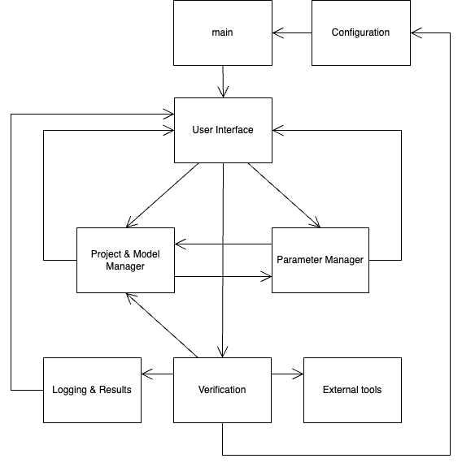
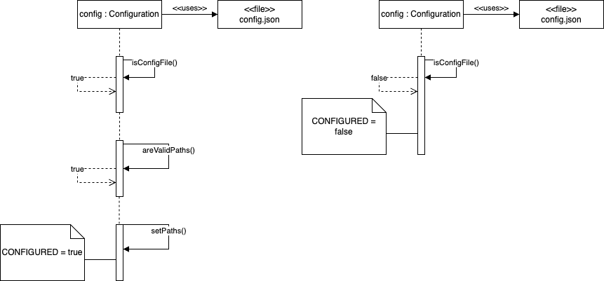
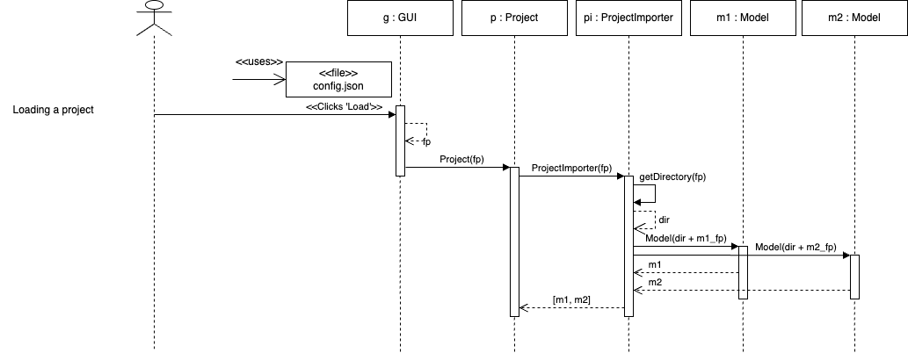

# Software Design Document
### ULTIMATE Multi-model Stochastic System Modelling, Verification and Synthesis Framework
**Version 0.1**  
**16/04/2025**

---

  

---
---
**Revision History**

| Date         | Version      | Description  | Author      |
|:------------:|:------------:|:------------:|:------------:
|16/04/2025    | 0.1          | Initial draft| Micah Bassett|

---
## Table of Contents

- [1. Introduction](#1-introduction)
  - [1.1 Purpose](#11-purpose)
  - [1.2 Scope](#12-scope)
  - [1.3 Terms & Definitions](#13-terms--definitions)

- [2. System Overview](#2-system-overview)
- [3. System Architecture](#3-system-architecture)
	- [3.1 Architectural Design](#31-architectural-design)
	- [3.2 Decompositional Description](#32-decompositional-description)

## 1. Introduction

### 1.1 Purpose

This Software Design Document (SDD) describes the design and system architecture of the ULTIMATE tool, a system for modelling, managing, and verifying complex systems of stochastic models. The document is intended to guide future development, maintenance, testing, and integration activities. After reading this document, the reader will be well positioned to dive into the source code of the tool and to make changes and add/enhance features of the tool. 

### 1.2 Scope

The ULTIMATE tool supports the construction and analysis of multi-model stochastic systems. It allows users to import, parameterize, and verify probabilistic models via a graphical interface or command-line interface. The system integrates existing probabilistic model checkers (PRISM and Storm) and adds unique support for for creating systems of models by allowing the user to define dependencies between models. The tool allows users to extend models further by providing learned paramters (called external parameters) and adjustable internal parameters.

### 1.3 Terms & Definitions

| Term | Definition |
|:----|:----------|
|SDD| Software Design Document|

## 2. System Overview

The ULTIMATE tool provides a unified environment for researchers to construct, parameterize, and verify complex systems of interdependent stochastic models. Through both an interactive graphical interface and a command‑line interface, users can import PRISM‑format model files, automatically detect and categorize undefined constants into External, Dependency, or Internal Parameters, and orchestrate verification tasks across multiple models in a single 'World Model' (ULTIMATE project file). By leveraging established probabilistic model checkers such as PRISM and Storm, ULTIMATE abstracts away the intricacies of individual tools and presents a seamless workflow for end‑to‑end system analysis.

Although the GUI is completely self‑contained, providing dialogs for project creation, model management, parameter definition and real‑time progress feedback, the core verification engine delegates all computational work to external binaries (PRISM and Storm). A simple configuration file ensures that the paths to PRISM and Storm executables are correctly registered at startup. 'World Models' are persisted to the file system in a human‑readable format, allowing users to share, reproduce, and modify their analyses over time.

At its core, ULTIMATE acts as an orchestrator: it mediates user commands, transforms model files and parameter definitions into verification tasks, invokes the chosen PMC, and captures the resulting traces and metrics. Researchers interact with the tool via mouse‑driven menus and dialogs in the GUI or via succinct command‑line arguments in batch mode. In both cases, the tool enforces consistency by verifying that all required parameters and inter‑model dependencies are fully specified before launching any verification job.

The design of ULTIMATE is guided by three primary drivers: modularity, to facilitate the future addition of new model checkers or parameter types; extensibility, so that new stochastic model formalisms can be supported without major rewrites; and usability, ensuring that both novice and expert users can focus on system verification rather than the mechanics of tool integration. This combination of high‑level orchestration and flexible architecture makes ULTIMATE a powerful research platform for the formal analysis of modern stochastic systems.

## 3. System Architecture

### 3.1 Architectural Design

The architecture of the ULTIMATE tool is designed around modular principles, enabling separation of concerns, ease of maintenance, and extensibility. The system is partitioned into a collection of high-level subsystems, each responsible for a distinct aspect of functionality. These subsystems interact through well-defined interfaces, ensuring clear boundaries and minimal coupling between components.

At the highest level, the system consists of the following major subsystems:

- **User Interface Layer (GUI/CLI)**: This subsystem handles all user interactions. The GUI provides an intuitive workspace with visual tools for model management, parameter definition, and result viewing. The CLI allows batch processing and script-driven verification. Both interfaces interact with the same underlying services.
  
- **Project & Model Management Subsystem**: Responsible for loading, saving, and maintaining the structure of user projects. This includes storing references to models, managing properties and parameters, and persisting the overall project state to disk.

- **Parameter Management Subsystem**: Extracts undefined constants from model files and manages the definition and categorization of parameters as Environment Parameters (EPs), Dependency Parameters (DPs), or Internal Parameters (IPs). This subsystem ensures that all required parameters are fully specified before verification.

- **Verification Engine**: Coordinates verification tasks across one or more models. It constructs verification workflows, resolves inter-model dependencies (especially for DPs), and invokes external PMCs (PRISM or Storm). This subsystem handles all logic related to dependency graphs, parameter substitution, and tool selection.

- **External Tool Interface**: Provides a wrapper around external probabilistic model checkers (PMCs). This includes invoking PRISM and Storm binaries, capturing their output, and interpreting the results for integration into the GUI or CLI output.

- **Logging & Results Subsystem**: Captures all tool activity during runtime. Logs can be viewed in real-time, saved to disk, or exported for debugging and crash reporting. Verification results, including dependency traces and final outcomes, are collected here and made accessible to the user.

- **Configuration Subsystem**: Manages tool startup configuration, including locating external binaries (e.g., Storm), validating system paths, and preparing the tool for use.

These subsystems are orchestrated by a central controller or application kernel that ensures consistent flow and state across the tool. Communication between subsystems follows a service-oriented pattern, allowing the UI components to remain agnostic of the underlying logic while still benefiting from a responsive and coherent experience.

Below is a high-level architectural diagram that illustrates the primary subsystems and their interactions:

  
  
To summarize, first the configuration component ensures the software configuration file is valid and if it is, it passes a message to main to continue execution. Next, main will create a GUI instance which will allow the user to add models, define parameters, create/update projects etc. All of these components will communicate with the GUI so it can update the data it is displaying. From the GUI, the user can initiate verification which will ensure the current project contains fully defined models before it invokes the external tools to carry out verification.  Additionally, the verification component will retieve the paths to the external tools from the configuration component. All of this information will be passed to the logger, which in turn will update the GUI. 

### 3.2 Decompostional Description

**Configuration Component**:

As mentioned, this component is responsible for ensuring that the software configuration file contains all the information to launch the tool and run verification. The configuration file for the tool is very simple. It contains 5 strings in a json file, each of which is the path to a binary on the system that is needed for the tool (these are installed separatley). The component first verifies that the json file is correctly formatted and that it contains all the expected key values. Next, for each key, the path is extracted and confirmed if it points to a binary that exists. If both of these checks are passed, the component considers the file valid and these paths are stored in the component which utilises a singleton pattern so it may be used by other components, chiefly the verification component. Below is simple sequence diagram of the component (occurs during intialization):

  
  
The **Configuration** component has no public methods. Instead, each string is static and is simply accessed by calling something like 'Configuration.PRISM_PATH'. This keeps the component simple, although it does introduce the possibility for these important strings to be mutated accidentaly - a consideration for future improvement. 

**User Interface Component (GUI/CLI)**:

This component is how the user interacts with the tool and issues commands to it. As the tool can be used in either a GUI or CLI mode, there is really two seperate concerns with this component. However, I will only focus on the GUI as the CLI is self-explanatory and very simple. As one would expect, the CLI version has a detailed help menu which explain all the functionality available to the user through it. It is important to note, however, the CLI only allows users to run verification tasks using already completed projects (all the models are fully defined). There is no way the user can edit models, projects etc using the CLI as this would result in very verbose arguments. Therefore, this functionality is only provided by the GUI.

The functionality of the GUI is acheived through a number of layout files (xml) and correspodning controller classes (java). The GUI is built on a java framework called *JavaFX* which is similar to swing but provides better dependency injection and thread management. Each layout/controller pair provides some micro-functionality to the user. For example, there is a pair for a section of the GUI that displays the models in the current project and provides buttons to add models, scroll through the list and delete models. The layout is static and can be adjusted without the need to change the logic in the controller class. The controller class will send a message to the appropriate system to be processed. For example, when the user adds a model to the project, the controller will send the data captured by the GUI to the *Project & Model Management* system to process, create a model and add it to the project. The GUI is event-driven and will detect the change and update it's displayed information. This is achieved by creating bindings in the controller classes to some data structure. When changes to the data structure are detected, graphical updates take place. 

**Project & Model Management Component:**

This component provides a way for the system to keep track of changes made to projects as well as providing the data structures used for verification. Every session is associated with a *Project* object. If the user loads the tool, by default it creates a blank project. When models are added, they are added to an array stored in the project object. This array is globally accesible as there is only a single project instance per session. Otherwise, the user can load an existing project into the tool and this becomes the project. In the latter case, the project component employs an importer class which will parse the project file, validate it and then create a project instance. Similarly, the user can save a project, in which case a project exporter is called to handle this. Essentially, this component contains all the parts needed to carry out verification, load projects, add models and save projects. 

As you may have guessed, this system is really made up of 4 sub-systems (classes):

* Project
* Project Importer
* Project Exporter
* Model 

Below is an example sequence of the user conducting a 'Load Project' action:

  
  
The GUI retrieves the filepath of the project file and creates a project object. The project calls the importer on this file which will parse the file and create the Model objects described by the file. These are then returned to the project object and stored in an array which is used globally by the rest of the program. 

**Parameter & Property Management Component:**

The purpose of this component is to add parameters and properties to models in the project. The user selects a model to edit in the GUI and enters the information in a dialog. This is passed to the component to validate, create the parameter/property and finally add it to the selected model. 

**Verification Engine Component:**

This component carries out verification by retriving the current project, the paths to the external tools and handing this information over to the appropriate binary to run. Due to the nature of ULTIMATE projects, this may involve mutiple calls to a PMC (PRISM/Storm) which is handled by the component. 

**External Tool Component:**

An API to PRISM and Storm. This calls these as threaded processes and collects the results from std out. These are then parsed and returned to be logged/displayed. 

**Logging & Results Component:**

