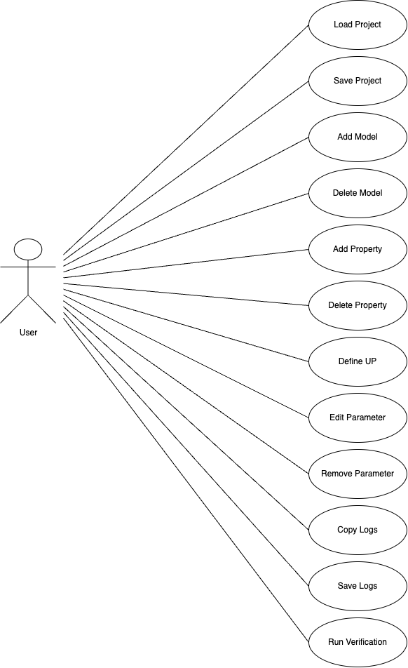
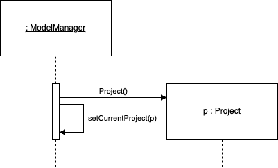
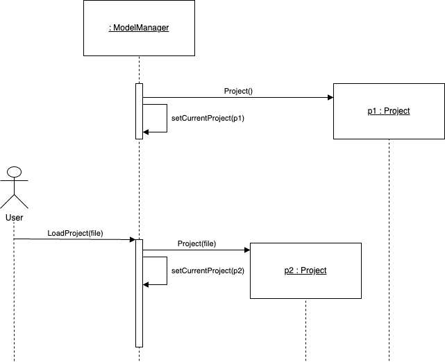

# REQUIREMENTS

## Problem Statement & Motivation

Existing probabalistic model checkers (**PMCs**) such as Prism and Storm restrict users to solving properties for a single model at a time. They provide no way for a user to solve for systems of models that may exhibit complex interdepedent relationships. While some systems of models may be relativley simple, allowing someone to solve them by hand, others will be so complex as to make this practically impossible. Indeed, this is often the case when creating systems of models that capture some real-world example. 

The **ULTIMATE Model Manager** tool aims to address this issue by providing a simple way to create and edit systems of models and employing algorithms to enable the user to solve properties within these systems despite the existence of complex interdependencies.

## Tool Description

The **ULTIMATE Model Manager** tool allows users to create systems of probabalistic models that may exhibit complex dependencies. Exisitng **PMCs** (Probabalistic Model Checkers) such as **Prism** and **Storm** allows users to verify properties for single model at a time. The **Model Manager** aims to extend these exisiting tools by allowing users to define systems of inter-dependant models and solve for properties on these models by algorthmically solving dependencies between models. 

## Statement of Requirements

The **ULTIMATE Model Manager** in an interactive graphical tool that allows the user to create systems of interdependent probabalistic models. With it, users may load in existing projects or create new projects. By default, when the tool is opened, an empty project is loaded into the space. Otherwise, the user may choose to load a project through a menu option (eg File -> Load). If the user chooses to load an exisiting project, they will be presented with a file dialog asking them to choose a project file (eg some_project.ultimate). Alternatively, they may add a single model to the current project. There will be a button with clear labelling indidcating to the user that pressinng the button will add a model to the workspace. When the button is pressed, they will choose a valid model file from the system through a file dialog. By default, the new model to be added to the project will be given the name of the module found in the model file (which may differ from the file name). The user may choose to edit the name of the model which will in turn edit the name of the module in the file so the two always match. The user will thenn confirm their choice and the model will be added to the workspace.  

In either case, when a project or models are added to the tool workspace, the user will be able to view the models in the current project as their names will be displayed in some list. The user can select any model from this list which will highlight the model and make it the current model.
When a model is chosen as the current model by selecting it, the user may add properties to or define parameters of the model in question. The user will have a choice of adding either a single property, which they will be prompted to define in a dialog, or they may choose a property file to add multiple properties to the currently selected model, which will open another file dialog. 

When a model is selected in the project space, any constants without assigned values that are found in the model file appear in the tool as a list of **"Uncategorised Parameters (UP)"**. For each **UP**, the user will be able to give it a concrete definition by adding it to one of the following categories:

* Environment Parameter (**EP**)
* Dependency Parameter (**DP**)
* Internal Parameter (**IP**)

For each category, there will be a list in the tool displaying the parameters that have been defined as such. Additonally, each of these lists will be labelled and contain a button to add a **UP** to the category. As each parameter type has different fields, the user is presented with unique dialog options to define the **UP** depending on whether they have chosen to define it as an **EP**, **DP** or **IP**. The fields used to define each category are as follows:

* **EP** -> name, data file (string path), type
* **DP** -> name, model ID, some property definition
* **IP** -> name

Each parameter will have the option to be edited or removed. If a parameter is removed, it simply reappears in the list of **UPs**. **UPs** cannot be removed from the model as they are derived from the model file. The file must be edited if the user wishes to remove some **UP**. Currently, the tool does not support editing of model files.

The user will have the option to run verification on the properties for the models in the project. In the case that a model is dependent on other models in the system, the user will be prompted to fully define each model (if not already done) before verification can take place. Otherwise, verification will proceed without this prompt. Additionally, the user may choose whether to run verification through Prism or Storm. In the case of the latter, the user will require an installation of Storm on their system and the tool will prompt the user to set the installation path before using Storm for verification. Prism, on the other hand, is integrated into the tool and requires no set-up so is used as the default PMC. During verification, a progress bar is displayed. When verification is complete, the user is shown a dialog confirming whether the verification was succesful or not. In either case, the view switches to a screen showing the logs of the verification attempt. These logs can be copied to the clipboard and/or saved to a file. This screen will also dsiplay a list of results which show the user:

* The name of the root model on which verification was run
* The results for the root model
* The path taken through the dependency graph during verification
* For each model visited, the result of verification on that model

The user will have the ability to save the current workspace as an ULTIMATE project. There will be both the typical **"Save"** and **"Save As"** options available. If the former is used before a file has been saved during the session, it will prompt the user to choose a name for the file and a save location, otherwise it will simply update the save file. The latter will always prompt the user with the option to choose a name and a save location. 

## Use Cases

The following use cases are derived from the statement of requirements;

* Load a project
* Create a model
* Delete a model
* Define a **UP**, for example as an **EP**
* Edit an **EP**, **DP** or **IP**
* Remove an **EP**, **DP** or **IP**
* Add a property or properties
* Delete property
* Copy Logs
* Save Logs
* Run verification
* Save a project

An **UML** representation of the identified use cases:

    

### Load Project

Following the OOP design guideline that domain concepts should be modelled as objects, it is natural to model the **Model Manager (MM)** itself as an object. Each project will be modelled as a **Project** object. In this manner, the **MM** and **Project** objects have a relationship such that a **Project** will belong to an **MM**. That is, a **Project** is instantiated and managed by an **MM**. It is also possible for an **MM** object to manage many instances of **Project**. Below, both the scenario of a single project as well as multiple projects is modelled. In the case of the latter, an additional link called *current* is included to show which **Project** is currenly being managed by the **MM**.

	

As mentioned in the requirements, when the tool is first loaded, an empty **Project** is the default. Before diagramming a realisation of loading a project, it is worth putting together a sequence of what occurs when the tool first starts up. Below is the default sequence when launching the tool:

	

**Note:** Here there is no actor as the above is simply showing what the tool will do by default on launch

The following sequence diagram details what happens when the user chooses *Load Project* in the tool:

	
	
The above describes a realisation of the user carring out the action *Load Project*. 